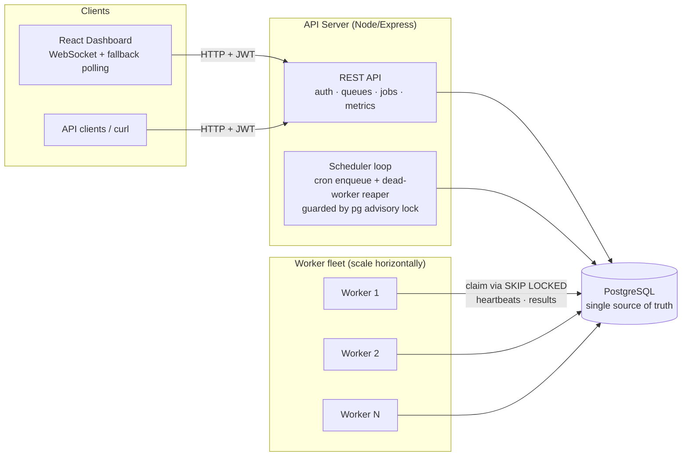
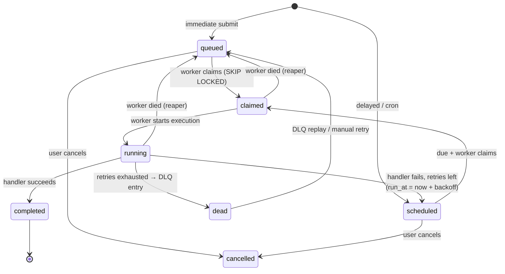

# Architecture

## The shape of the system

*(Viewing this outside GitHub? A rendered copy: [images/architecture.png](images/architecture.png))*

Three kinds of process, and they never talk to each other directly — only
through the database:

1. **The API server** (`npm start`). Serves the REST API, runs the background
   scheduler loop (enqueue due cron jobs, reap dead workers) every 2 seconds,
   and relays job events to dashboard clients over WebSocket. The loop takes
   a Postgres advisory lock per tick, so you can run several API instances
   behind a load balancer and exactly one of them does the tick.
2. **Workers** (`npm run worker`) — any number, anywhere that can reach the
   database. They claim jobs atomically, run them with per-queue concurrency
   and timeouts, write execution records and logs, and heartbeat every 5s.
3. **PostgreSQL**, which is the coordination point. Every distributed-systems
   problem here (mutual exclusion, visibility, ordering) is delegated to the
   database's transactional guarantees instead of a separate broker — the
   reasoning is in [design-decisions.md](design-decisions.md).

## Job lifecycle

*(Viewing this outside GitHub? A rendered copy: [images/job-lifecycle.png](images/job-lifecycle.png))*

A note on `scheduled`: it does double duty. A job created with a delay starts
there, and a job waiting out its retry backoff goes back there. To the claim
query they're the same thing — "not due yet" — which keeps the state machine
small.

## Claiming — the part I'd defend hardest

Workers claim with one SQL statement ([claim.js](../server/src/worker/claim.js)),
built as a three-stage CTE:

1. **ranked** — every claimable job (due, queue not paused, all dependencies
   completed, queue in this worker's shard), with a per-queue rank and the
   queue's current active count and last-minute execution count.
2. **eligible** — the jobs whose rank fits under both `max_concurrency` and
   `rate_limit_per_minute`, ordered by queue priority, then job priority,
   then age.
3. **locked** — `FOR UPDATE SKIP LOCKED` over the survivors, then a single
   `UPDATE ... SET status = 'claimed'`.

`SKIP LOCKED` is what makes concurrent claiming safe *and* fast: each worker
locks a disjoint set of rows, so a job can't go to two workers, and nobody
queues up behind anyone else's locks. The reason the limits live inside this
query rather than in application code: checking a limit and then claiming in
two steps is a race. Anything that decides eligibility has to be decided
atomically with the claim itself. (Why the lock is a separate stage: Postgres
won't combine `FOR UPDATE` with window functions at the same query level.)

## What happens when things fail

- **A handler throws or times out.** The attempt is recorded in
  `job_executions` with the error. Retries left → back to `scheduled` with
  `run_at = now + backoff(strategy, attempt)`. Retries exhausted → `dead`,
  a `dead_letter_jobs` row for a human to inspect and replay, and any
  dependent jobs cascade-cancelled.
- **A worker dies.** Its heartbeat goes stale; after 15s the reaper marks it
  offline, flags its running executions as `lost`, and requeues its jobs
  without incrementing attempts. If the worker wasn't actually dead (GC
  pause, laptop lid) and finishes anyway, its completion write matches zero
  rows — every terminal write is guarded by
  `WHERE status = 'running' AND claimed_by = me`.
- **The scheduler crashes mid-tick.** The cron job it was about to enqueue
  carries idempotency key `cron:<schedule>:<occurrence>`, so the retried tick
  inserts nothing. An occurrence fires at most once.
- **A worker is asked to stop (SIGTERM).** It stops claiming, drains in-flight
  jobs up to a grace period, releases anything unfinished back to the queue,
  and marks itself offline.

## Event flow (latency, not correctness)

Postgres LISTEN/NOTIFY doubles as the event bus:

- `job_ready` fires when a job is enqueued, requeued or replayed; workers
  LISTEN and claim immediately instead of waiting out the poll interval.
- `job_events` fires on every status transition; the API server relays these
  to dashboard clients over `/ws` (JWT-checked on connect).

Both are fire-and-forget by design. The worker poll loop and the dashboard's
slow poll remain underneath as the guarantee of progress, so a missed
notification costs a second of latency, never correctness.
