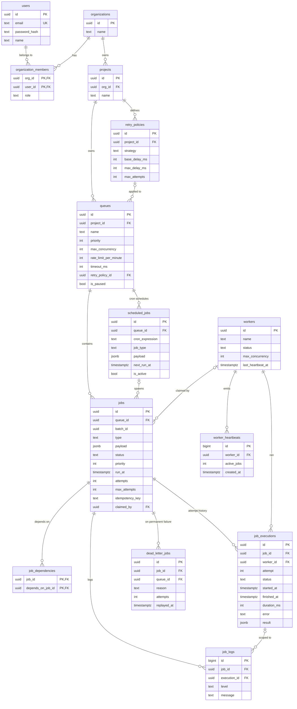

# Schema & ER diagram

*(Viewing this outside GitHub? A rendered copy: [images/er-diagram.png](images/er-diagram.png))*

The full DDL is one file: [schema.sql](../server/src/db/schema.sql). Below is
the reasoning behind the choices, which I think matters more than the
diagram.

## Keys

Entity tables use UUID primary keys (`gen_random_uuid()`) so ids can be
generated anywhere without coordination and never collide across
environments. The two append-only, high-volume tables — `job_logs` and
`worker_heartbeats` — use `BIGSERIAL` instead: small, ordered keys index
better, those tables grow fastest, and nothing external ever references their
rows. `organization_members` is a pure join table, so it gets a composite
primary key `(org_id, user_id)` rather than a surrogate id it doesn't need.

## Foreign keys and what deletes do

I split references into two kinds. Ownership chains cascade:
org → project → queue → job → executions/logs, so deleting a project takes
everything under it and can't leave orphans. References that aren't ownership
use `ON DELETE SET NULL` — `jobs.claimed_by`, `queues.retry_policy_id`,
`job_executions.worker_id` — because deleting a worker or a retry policy must
never destroy job history. The rule of thumb I followed: if the parent *owns*
the child, cascade; if the parent is merely *mentioned by* the child, null it
out and keep the row.

## Normalization, and the one place I broke it

The schema is 3NF: retry parameters live once in `retry_policies` and are
shared by queues; execution attempts are rows in `job_executions`, not
columns or arrays on `jobs`. There's one deliberate denormalization:
`max_attempts` (and the `attempts` counter) is copied onto each job at
creation. Two reasons — the worker's hot path can decide "retry or DLQ"
without a join, and editing a retry policy doesn't retroactively change jobs
already in flight, which is the behavior I'd want as an operator.

## Indexes that matter

- `jobs (queue_id, priority DESC, run_at) WHERE status IN ('queued','scheduled')`
  — the claim scan. It's **partial** on purpose: over time almost every job
  is completed or dead, and those rows never enter this index, so the hot
  path stays small no matter how much history accumulates.
- `jobs (queue_id, idempotency_key) UNIQUE WHERE idempotency_key IS NOT NULL`
  — dedupe enforced by the database rather than application logic. Partial,
  so jobs without a key don't pay for it.
- `scheduled_jobs (next_run_at) WHERE is_active` — the scheduler tick only
  ever scans active, due schedules.
- `job_executions (finished_at) WHERE finished_at IS NOT NULL` — the
  throughput and latency metrics all scan by finish time.
- `worker_heartbeats (worker_id, created_at DESC)` — "recent heartbeats for
  worker X", which the worker detail view hits.

## Statuses: TEXT + CHECK, not enums

Adding a state to a CHECK constraint is a cheap swap; evolving a native enum
historically meant an `ALTER TYPE` with locking side effects. There was no
upside to enums that I cared about, so I took the option that's easier to
change later.

## Growth

The claim path is a single index-backed statement and per-job reads are keyed
scans, so the day-one performance story is fine. The tables that grow without
bound are `job_executions`, `job_logs` and `worker_heartbeats`; at real scale
I'd partition jobs/executions by month, archive completed jobs, and prune
heartbeats older than a day — sketched in
[design-decisions.md](design-decisions.md).
